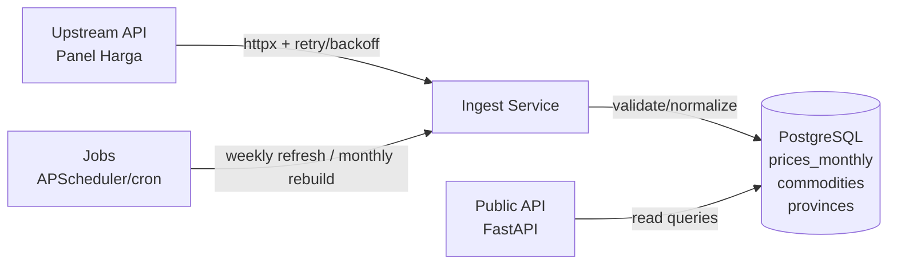

### Database Documentation

#### Entity Relationship (ER) Diagram
```mermaid
erDiagram
    COMMODITIES ||--o{ PRICES_MONTHLY : has
    PROVINCES   ||--o{ PRICES_MONTHLY : has

    COMMODITIES {
      text id PK
      text name
    }

    PROVINCES {
      text id PK
      text name
    }

    PRICES_MONTHLY {
      bigserial id PK
      text commodity_id FK
      text province_id FK
      int  level_harga_id
      date period_start
      date period_end
      numeric price
      text unit
      text checksum
      timestamptz inserted_at
      timestamptz updated_at
      UNIQUE (commodity_id, province_id, level_harga_id, period_start, period_end)
    }
```

#### Data Flow Diagram (Scrape → Cache → Serve)


#### Notes
- Unique window on `(commodity_id, province_id, level_harga_id, period_start, period_end)` enforces idempotent upsert.
- Store `unit` verbatim; do not aggregate across different units.
- Default query pattern sorts by `period_start DESC`; indexes added accordingly.

